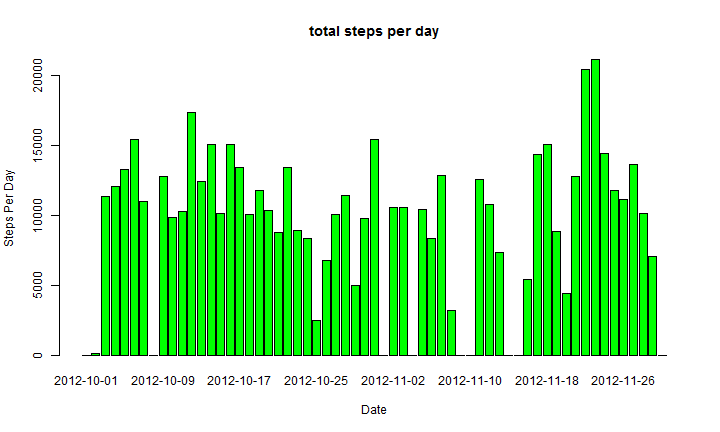
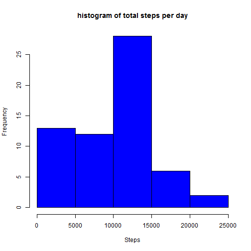
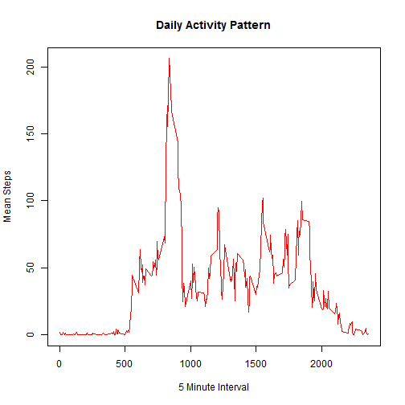
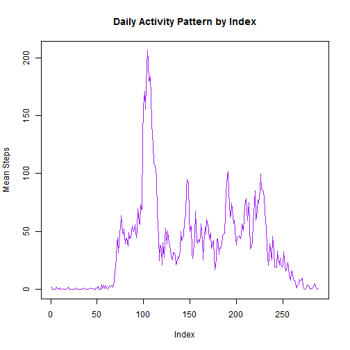
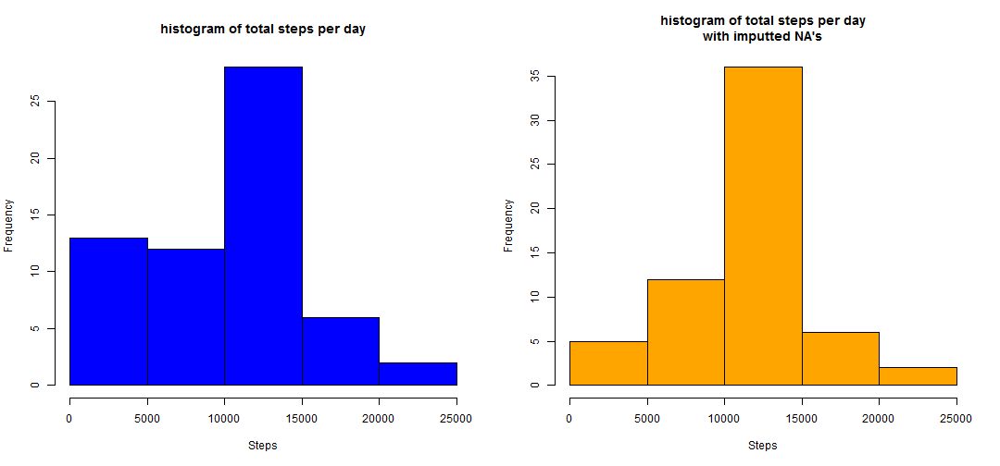
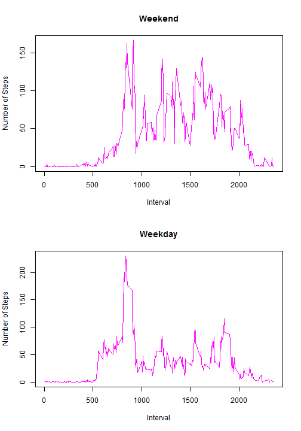

Activity Monitoring Data -- Reproducible Research
=================================================


### by Dave Martin
#### 5/13/2014


**Loading and preprocessing the data**

Show any Code that is needed to 

1. Load the data
2. Process/transform the data into a formate suitable for your analysis


```r
setwd("~/Data Science at Johns Hopkins/Reproducible/Assignment 1/repdata-data-activity")
dframe <- read.csv("activity.csv")
```


Initial look at the data structure:


```r
str(dframe)
```

```
## 'data.frame':	17568 obs. of  3 variables:
##  $ steps   : int  NA NA NA NA NA NA NA NA NA NA ...
##  $ date    : Factor w/ 61 levels "2012-10-01","2012-10-02",..: 1 1 1 1 1 1 1 1 1 1 ...
##  $ interval: int  0 5 10 15 20 25 30 35 40 45 ...
```


This shows that date is a factor.  It will be much easier to work with and think of date in POSIX format.  Use POSIXct:


```r
dc <- as.character(dframe$date)
date <- as.POSIXct(dc)
dframe$date <- date
str(dframe)
```

```
## 'data.frame':	17568 obs. of  3 variables:
##  $ steps   : int  NA NA NA NA NA NA NA NA NA NA ...
##  $ date    : POSIXct, format: "2012-10-01" "2012-10-01" ...
##  $ interval: int  0 5 10 15 20 25 30 35 40 45 ...
```


Note: as.POSIXct() expects caharacter strings of dates as "inputs" so the dates have to be converted from factors to characters first which are the converted into POSIXct.  The original factor-date is overwritten by POSIXct dates in the data frame.

**What is mean total number of steps taken per day?**

For this part of the assignment, you can ignore the missing values in the dataset.

1.  Make a histogram of the total number of steps taken each day
2.  Calculate and report the mean and median total number of steps taken per day

Calculate the total number of steps taken each day by using tapply():


```r
stepsdf <- tapply(dframe$steps, dframe$date, sum, na.rm = T)
stepsdf
```

```
## 2012-10-01 2012-10-02 2012-10-03 2012-10-04 2012-10-05 2012-10-06 
##          0        126      11352      12116      13294      15420 
## 2012-10-07 2012-10-08 2012-10-09 2012-10-10 2012-10-11 2012-10-12 
##      11015          0      12811       9900      10304      17382 
## 2012-10-13 2012-10-14 2012-10-15 2012-10-16 2012-10-17 2012-10-18 
##      12426      15098      10139      15084      13452      10056 
## 2012-10-19 2012-10-20 2012-10-21 2012-10-22 2012-10-23 2012-10-24 
##      11829      10395       8821      13460       8918       8355 
## 2012-10-25 2012-10-26 2012-10-27 2012-10-28 2012-10-29 2012-10-30 
##       2492       6778      10119      11458       5018       9819 
## 2012-10-31 2012-11-01 2012-11-02 2012-11-03 2012-11-04 2012-11-05 
##      15414          0      10600      10571          0      10439 
## 2012-11-06 2012-11-07 2012-11-08 2012-11-09 2012-11-10 2012-11-11 
##       8334      12883       3219          0          0      12608 
## 2012-11-12 2012-11-13 2012-11-14 2012-11-15 2012-11-16 2012-11-17 
##      10765       7336          0         41       5441      14339 
## 2012-11-18 2012-11-19 2012-11-20 2012-11-21 2012-11-22 2012-11-23 
##      15110       8841       4472      12787      20427      21194 
## 2012-11-24 2012-11-25 2012-11-26 2012-11-27 2012-11-28 2012-11-29 
##      14478      11834      11162      13646      10183       7047 
## 2012-11-30 
##          0
```


Make a plot.  Note: although the assignment calls for a "histogram", it makes more sense to create a barplot instead, since the data needs to be represented by (total steps per) day.  First a dataframe is created out of the results:


```r
sdf <- data.frame(unique(dframe$date), stepsdf)
colnames(sdf) <- c("date", "steps")
barplot(sdf$steps, col = "green", xlab = "Date", ylab = "Steps Per Day", main = "total steps per day")
```

 


Alternatively, the rigid interpretation of point (1) above requires that each day's steps be summed (variable "stepsdf", which is already done for the barplot) and then a histogram be made.  This is less informative than a barplot: 


```r
hist(stepsdf, xlab = "Steps", main = "histogram of total steps per day", col = "blue")
```

 


The *mean* of total number of steps per day is:


```r
mean(stepsdf, na.rm = T)
```

```
## [1] 9354
```


The *median* of total number of steps per day is:

```r
median(stepsdf, na.rm = T)
```

```
## [1] 10395
```


**What is the average daily activity pattern?**

1.  Make a time series plot (i.e. type = "l") of the 5-minute interval (x-axis) and the average number of steps taken, averaged across all days (y-axis)
2.  Which 5-minute interval, on average across all the days in the dataset, contains the maximum number of steps?

Calculate mean of steps of each 5 minute interval across the days -- use tapply.
Create a dataframe, then make a plot.

```r
meanstepsperint <- tapply(dframe$steps, dframe$interval, mean, na.rm = T)
interval <- unique(dframe$interval)
mspi.df <- data.frame(interval, meanstepsperint)
plot(mspi.df$interval, mspi.df$meanstepsperint, type = "l", xlab = "5 Minute Interval", 
    ylab = "Mean Steps", main = "Daily Activity Pattern", col = "red")
```

 


An alternative time series plot of the same data with the index value at the x-axis is:


```r
index <- 1:length(interval)
mspi.df$index <- index
plot(mspi.df$index, mspi.df$meanstepsperint, type = "l", xlab = "Index", ylab = "Mean Steps", 
    main = "Daily Activity Pattern by Index", col = "purple")
```

 


To find out which 5 minute interval had the highest average number of steps, use max() and match() to find the index that points to the interval that had the highest average number of steps:


```r
topmeansteps <- max(meanstepsperint)
indexoftop <- match(topmeansteps, meanstepsperint)
mspi.df$interval[indexoftop]
```

```
## [1] 835
```


**Imputing missing values**

Note that there are a number of days/intervals where there are missing values (coded as NA). The presence of missing days may introduce bias into some calculations or summaries of the data.

1.  Calculate and report the total number of missing values in the dataset (i.e. the total number of rows with NAs)

2.  Devise a strategy for filling in all of the missing values in the dataset. The strategy does not need to be sophisticated. For example, you could use the mean/median for that day, or the mean for that 5-minute interval, etc.

3.  Create a new dataset that is equal to the original dataset but with the missing data filled in.

4.  Make a histogram of the total number of steps taken each day and Calculate and report the mean and median total number of steps taken per day. Do these values differ from the estimates from the first part of the assignment? What is the impact of imputing missing data on the estimates of the total daily number of steps?

Part 1: Calculate the total number of missing values in the dataset.

```r
sum(!complete.cases(dframe))
```

```
## [1] 2304
```


Part 2.  Imputing NA's: choose mean of that interval.  Use tapply() to find means organised by interval:


```r
meanstepsint <- tapply(dframe$steps, dframe$interval, mean, na.rm = T)
```


Part 3.  Create a new dataset that is equal to the original dataset but with the missing data filled in.  Note: a side effect of using mean value will coerce the "steps" variable from integer into numeric.


```r
i.dframe <- dframe  # clone the data frame for NA imputting
interval <- unique(i.dframe$interval)
indexv <- 1:length(i.dframe$steps)  # get a vector with the same lengths steps
rvect <- !complete.cases(i.dframe)  # rvect is a T/F vector of cases with NA
missing.vector <- indexv[rvect]  # creates a vector identifying where the NA's are
for (i in missing.vector) {
    i.dframe$steps[i] <- meanstepsint[[match(dframe$interval[i], interval)]]
}
```


Part 4.  Make a histogram of the total number of steps taken each day and Calculate and report the mean and median total number of steps taken per day. Do these values differ from the estimates from the first part of the assignment? What is the impact of imputing missing data on the estimates of the total daily number of steps?


```r
i.totalstepsperday <- tapply(i.dframe$steps, i.dframe$date, sum)
par(mfrow = c(1, 2))
hist(stepsdf, xlab = "Steps", main = "histogram of total steps per day", col = "blue")
hist(i.totalstepsperday, xlab = "Steps", main = "histogram of total steps per day\nwith imputted NA's", 
    col = "orange")
```

 


This results in a very different outcomes.  The right hand histogram has imputed values while the left hand histogram is the original with the daily sums calculated by ignoring NA's.


```r
i.mean <- mean(i.totalstepsperday)
o.mean <- mean(stepsdf, na.rm = T)
print(paste("the original mean is:", o.mean, "  after imputing the mean became:", 
    i.mean))
```

```
## [1] "the original mean is: 9354.22950819672   after imputing the mean became: 10766.1886792453"
```

```r

i.median <- median(i.totalstepsperday)
o.median <- median(stepsdf, na.rm = T)
print(paste("the original median is:", o.median, "after imputing the median became:", 
    i.median))
```

```
## [1] "the original median is: 10395 after imputing the median became: 10766.1886792453"
```


Note on imputing values: there are packages that will use more sophisticated methods to impute missing values in the dataset.  One of the easiest to use is irmi() from the VIM package.  There is also Amelia.  These use different methods and strategies to fill in the missing values.  Obviously different packages/imputting functions will yield different results.  One must still understand the underlying strategies to ensure suitability before actually using them. 

**Are there differences in activity patterns between weekdays and weekends?**

1.  Create a new factor variable in the dataset with two levels -- "weekday" and "weekend" indicating whether a given date is a weekday or weekend day.

2.  Make a panel plot containing a time series plot (i.e. type = "l") of the 5-minute interval (x-axis) and the average number of steps taken, averaged across all weekday days or weekend days (y-axis).

Part 1. Create a new factor variable of "weekday" and "weekend":

```r
weekdaysv <- weekdays(i.dframe$date)
weekendlv <- weekdaysv %in% c("Saturday", "Sunday")
days <- NULL
days[weekendlv] <- "weekend"
days[!weekendlv] <- "weekday"
days <- as.factor(days)
i.dframe$days <- days
```


inspect the results:

```r
head(i.dframe)
```

```
##     steps       date interval    days
## 1 1.71698 2012-10-01        0 weekday
## 2 0.33962 2012-10-01        5 weekday
## 3 0.13208 2012-10-01       10 weekday
## 4 0.15094 2012-10-01       15 weekday
## 5 0.07547 2012-10-01       20 weekday
## 6 2.09434 2012-10-01       25 weekday
```

```r
str(i.dframe)
```

```
## 'data.frame':	17568 obs. of  4 variables:
##  $ steps   : num  1.717 0.3396 0.1321 0.1509 0.0755 ...
##  $ date    : POSIXct, format: "2012-10-01" "2012-10-01" ...
##  $ interval: int  0 5 10 15 20 25 30 35 40 45 ...
##  $ days    : Factor w/ 2 levels "weekday","weekend": 1 1 1 1 1 1 1 1 1 1 ...
```


part 2.  Create two panel plots of the average of steps for each 5 minute intervals, one for the weekdays and the other for weekend days.  First the data frame is subsetted into weekday and weekend groups.  The mean steps per interval are calculated and plotted.

```r
weekenddf <- subset(i.dframe, i.dframe$days == "weekend")
weekdaydf <- subset(i.dframe, i.dframe$days == "weekday")

meanstepsweekend <- tapply(weekenddf$steps, weekenddf$interval, mean)
meanstepsweekday <- tapply(weekdaydf$steps, weekdaydf$interval, mean)

par(mfrow = c(2, 1))
plot(unique(weekenddf$interval), meanstepsweekend, main = "Weekend", xlab = "Interval", 
    ylab = "Number of Steps", type = "l", col = "magenta")
plot(unique(weekdaydf$interval), meanstepsweekday, main = "Weekday", xlab = "Interval", 
    ylab = "Number of Steps", type = "l", col = "magenta")
```

 


It is clear that the test subject walks around a lot more over the weekends than over the weekdays (compare intervals 1000 through 2000).  Perhaps the subject has a job that prevents him or her from being more active during the course of a workday.
